# Contexte

Le but du TP est de créer un cluster Cassandra de 3 nœuds, fonctionnant selon une architecture distribuée sans nœud maître, et containerisé avec Docker.


L'API choisie pour ce projet est OverFast API (https://overfast-api.tekrop.fr/#tag/Heroes). Cette API reprend les données des personnages d'Overwatch, un jeu de tir en ligne  développé et publié par Blizzard Entertainment. C'est une API créée par une personne tierce en se basant sur les données fournies par Blizzard.
Puisque certaines données accessibles via l'API sont de grandes données texte, ou des liens url, seules certaines colonnes ont été choisies pour les besoins du TP :
- `hero_key`
- `name`
- `role`
- `subrole`
- `location`
- `age`
- `health`
- `shields`
- `armor`
- `total_hp`


# Création du KEYSPACE
```sql
CREATE KEYSPACE overwatch
WITH replication = {
  'class': 'NetworkTopologyStrategy',
  'dc1': 3
};
```

Le keyspace a été créé dès le départ avec un facteur de réplication de 3 dans le datacenter dc1.

# Ingestion des données
Les données sont récupérées et injectées à l'aide d'un script python get_overwatch.py
Des requêtes métiers permettent d'afficher les données d'intérêt (par exemple, tous les héros ayant le rôle "tank")

USE overwatch;


DESCRIBE TABLES;

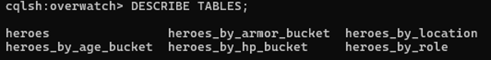


SELECT hero_key, name, role, total_hp
FROM heroes
LIMIT 10;

Voici un exemple des données reccueillies

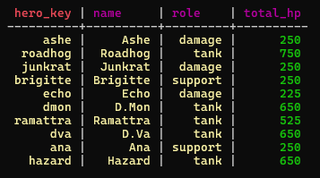

La table contient bien 53 lignes, correspondant aux héros importés.


# Démarrage du cluster

Lancement de chaque node un par un

docker compose up -d cass1

docker compose up -d cass2

docker compose up -d cass3


# Topologie et vérifications

- Sortie `nodetool status`

docker exec cass1 nodetool status

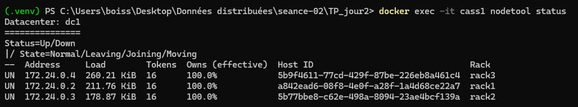

Les 3 nodes sont en UN

- Sortie `nodetool describecluster`

docker exec cass1 nodetool describecluster

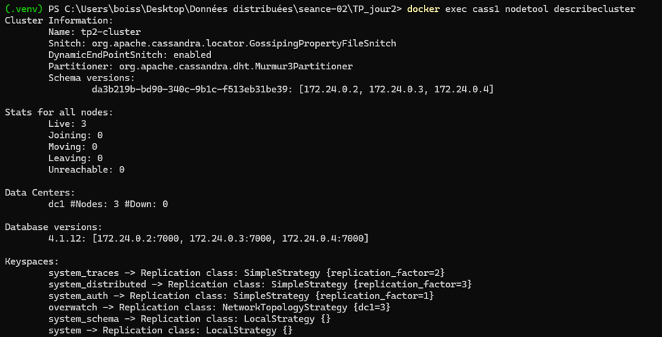

Description du cluster

- Sortie `nodetool ring`

docker exec cass1 nodetool ring

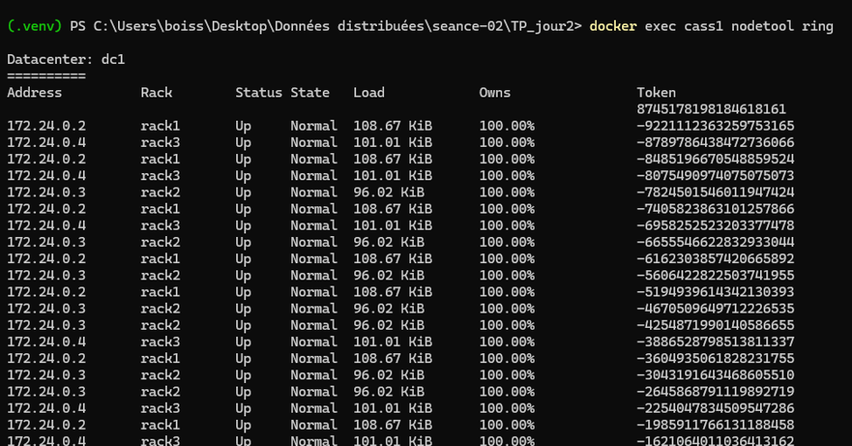

Chaque nœud possède 16 tokens. Avec 3 nœuds, le cluster contient donc 48 tokens au total, utilisés pour répartir les partitions dans l’anneau Cassandra.


- Sortie `nodetool getendpoints`

docker exec cass1 nodetool getendpoints overwatch heroes winston 

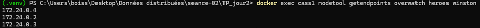

La commande retourne les 3 endpoints responsables de la partition `winston`. Avec un facteur de réplication de 3 et 3 nœuds dans `dc1`, cela signifie que cette partition est répliquée sur les 3 nœuds du cluster.


# Schéma et réplication

- `CREATE KEYSPACE overwatch` avec NetworkTopologyStrategy, dc1:3
- `DESCRIBE KEYSPACE overwatch`

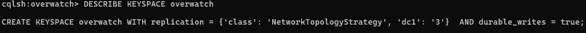

# Données métier

- `SELECT count(*) FROM overwatch.heroes;`

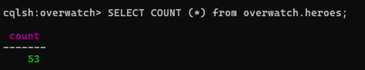

- Exemples de requête

Pour permettre une requête efficace sur l’âge sans utiliser ALLOW FILTERING, une table orientée requête a été créée : `heroes_by_age_bucket`.


CREATE TABLE IF NOT EXISTS overwatch.heroes_by_age_bucket (
  age_bucket text,
  age int,
  hero_key text,
  name text,
  role text,
  total_hp int,
  armor int,
  location text,
  PRIMARY KEY ((age_bucket), age, hero_key)
) WITH CLUSTERING ORDER BY (age ASC, hero_key ASC);

-- Requête:
SELECT hero_key, name, role, age
FROM overwatch.heroes_by_age_bucket
WHERE age_bucket = 'all' AND age < 18;

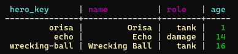


# Niveaux de cohérence

- `avec les 3 nodes UN`

CONSISTENCY ONE;

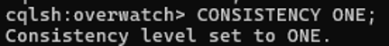

SELECT hero_key, name, role, total_hp
FROM heroes
WHERE hero_key = 'winston'; 

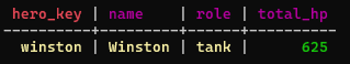

La lecture fonctionne car le niveau ONE nécessite la réponse d’un seul réplica disponible.

CONSISTENCY QUORUM;

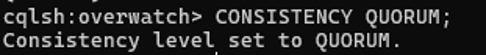

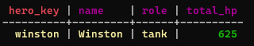

La lecture fonctionne car, avec RF=3, le niveau de cohérence QUORUM nécessite la réponse d’au moins 2 réplicas sur 3.

CONSISTENCY ALL;

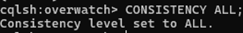

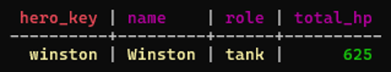

La lecture réussit car le quorum est atteint : avec un facteur de réplication de 3, Cassandra doit obtenir la réponse d’au moins 2 réplicas sur 3.


- `En résumé`

Nous avons testé les niveaux de cohérence ONE, QUORUM et ALL sur la table métier overwatch.heroes avec la clé hero_key = 'winston'.
Avec RF = 3 :
- ONE réussit dès qu’un seul réplica répond ;
- QUORUM réussit lorsque deux réplicas sur trois répondent ;
- ALL réussit uniquement lorsque les trois réplicas répondent.
Lorsque les trois nœuds Cassandra sont actifs, les trois lectures réussissent. 


# Simulation de panne

- `Arrêter cass3`

docker stop cass3

- `Vérification arrêt cass3 `

docker exec cass1 nodetool status

cass3 apparaît en DN

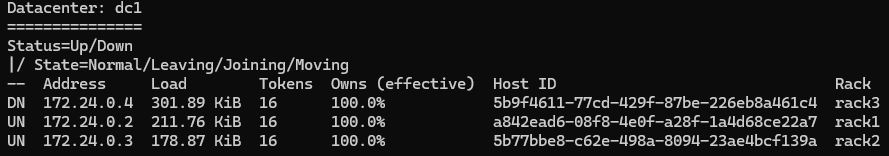

- `Vérification arrêt cass3 2`

docker ps -a --filter "name=cass3"

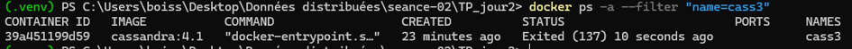

- `Test de cohérence avec cass3 stoppé`

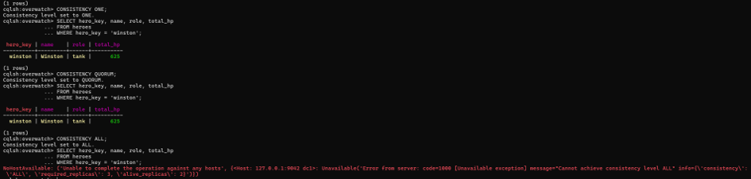

- `relancer cass3`

docker start cass3

- `Vérification relance et récupération des données 1`

docker exec cass1 nodetool getendpoints overwatch heroes winston

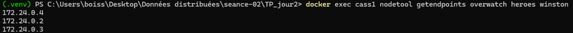

- `Vérification relance et récupération des données 2`

docker exec cass3 cqlsh -e "SELECT count(*) FROM overwatch.heroes;"

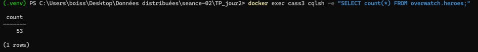

On obtient bien les 53 lignes de données

# Observations et conclusion

- Répartition des données (tokens, endpoints)

Les données du keyspace overwatch sont répliquées sur les trois nœuds grâce au facteur de réplication RF=3.


- Impact de la panne sur les différents niveaux de cohérence

La panne n'a eu aucun impact sur l'intégrité des données. Rien n'a été perdu dans les autres nodes, tout a été récupéré dans le node cassé. Cependant, les différents niveaux de cohérences n'étaient pas tous respecté. ONE et QUORUM n'ont pas bloqué les requêtes car les données étaient bien présente sur au moins un, ou au moins deux nodes sur trois. Par contre le niveau de cohérence ALL n'était pas satisfaits du fait de la panne de cass3 et a bloqué la requête

- Bonnes pratiques retenues

Tu peux mettre quelque chose comme ça dans **“Bonnes pratiques retenues”** :


# Bonnes pratiques retenues

- Définir correctement la topologie Cassandra dès le démarrage du cluster : nom du cluster, datacenter, racks et snitch (`GossipingPropertyFileSnitch`).

- Vérifier l’état du cluster avant toute opération importante avec `nodetool status`, afin de s’assurer que les nœuds sont bien en état `UN` (Up/Normal).

- Créer le keyspace avec une stratégie de réplication adaptée au cluster. Dans ce TP, `NetworkTopologyStrategy` avec `dc1: 3` permet de répliquer chaque partition sur trois réplicas.

- Contrôler la réplication avec `DESCRIBE KEYSPACE` et `nodetool getendpoints` pour vérifier quels nœuds sont responsables d’une partition donnée.

- Utiliser les niveaux de cohérence selon le besoin :
  - `ONE` privilégie la disponibilité ;
  - `QUORUM` offre un compromis entre disponibilité et cohérence ;
  - `ALL` garantit une cohérence forte mais nécessite que tous les réplicas soient disponibles.

- Tester les comportements en cas de panne afin de comprendre l’impact des niveaux de cohérence sur les lectures et écritures.

- Après le redémarrage d’un nœud, vérifier son retour dans le cluster avec `nodetool status` et contrôler que les données sont accessibles.


- Éviter les requêtes avec `ALLOW FILTERING` en Cassandra. Il est préférable de créer des tables orientées requêtes, comme les tables `heroes_by_*`.

- Documenter les commandes utilisées et les résultats observés pour faciliter la reproduction du cluster et l’analyse des incidents.

# Réponses aux questions

- Question 1

Après le démarrage des trois nœuds :
•	combien de nœuds sont présents ? 3
•	quel est leur état ? UN
•	dans quel datacenter sont-ils placés ? dc1
•	dans quels racks sont-ils placés ? chacun dans son rack. cass1 dans rack1 par exemple

- Question 2

•	Présentez brièvement l'architecture obtenue.
Cluster
 └── dc1
     └── rack1
          └── cass1
     └── rack2
           └── cass2
     └── rack3
          └── cass3

•	Expliquez la différence entre :
•	Cluster : Ensemble complet du système distribué
•	Datacenter : Groupe de nodes situé dans une même zone ou un même site
•	Rack : 	Sous-groupe de nodes dans un datacenter
•	Node : 	Machine individuelle qui stocke et traite les données

- Question 3

Présentez brièvement votre table métier :
•	nom du keyspace ; `overwatch`
•	nom de la table ; `heroes`
•	principales colonnes ; `hero_key`, `name`, `role`, `subrole`, `location`, `age`, `health`, `shields`, `armor`, `total_hp`
•	partition key ; `hero_key`
•	clustering key éventuelle : aucune

- Question 4

Expliquez ce que signifie :
RF = 3
pour une partition de votre table métier.

Cela signifie que, dans le datacenter `dc1`, chaque partition de la table métier est copiée sur __3 nœuds différents__.


Expliquez notamment la différence entre :
Partitionnement : Le __partitionnement__ consiste à répartir les données dans le cluster.
Réplication : La __réplication__ consiste à copier une même partition sur plusieurs nœuds.


- Question 5

Expliquez brièvement le chemin suivant pour une donnée de votre table métier :

Partition key : hero_key. La __partition key__ est la valeur qui identifie la partition de la donnée. Exemple : hero_key = 'winston'
↓
Hash : Cassandra applique une fonction de __hash__ sur la partition key. Ce hash transforme la clé en une valeur numérique utilisée pour positionner la donnée dans l’anneau Cassandra.
↓
Token : Le résultat du hash donne un __token__. Ce token correspond à une position dans l’anneau Cassandra.
↓
Nœud(s) responsable(s) : Cassandra regarde dans l’anneau quel nœud possède la plage de tokens correspondant au token calculé. Ce nœud devient le __nœud responsable principal__ de la partition.
↓
Réplicas : RF = 3. La partition est stockée sur 3 réplicas

Pour une donnée de la table overwatch.heroes, Cassandra utilise la partition key hero_key. Par exemple, pour hero_key = 'winston', Cassandra applique une fonction de hash sur cette clé afin d’obtenir un token. Ce token correspond à une position dans l’anneau Cassandra. Cassandra détermine ensuite le ou les nœuds responsables de la plage de tokens concernée.

Comme le keyspace overwatch est configuré avec RF = 3 dans le datacenter dc1, la partition n’est pas stockée sur un seul nœud : elle est répliquée sur trois nœuds. Dans ce cluster composé de cass1, cass2 et cass3, la partition est donc présente sur les trois nœuds sous forme de réplicas.


- Question 6

Comparez les trois niveaux :

Niveau	Réplicas nécessaires avec RF=3
ONE	1
QUORUM	2
ALL	3
Expliquez en quelques lignes :

Avec RF = 3, chaque partition est stockée sur trois réplicas.

Le niveau ONE nécessite la réponse d’un seul réplica. Il offre donc une forte disponibilité, mais une cohérence plus faible, car le réplica lu peut ne pas être parfaitement à jour.

Le niveau QUORUM nécessite deux réponses sur trois. Il représente un compromis entre cohérence et disponibilité. Avec RF = 3, il peut continuer à fonctionner si un nœud est en panne.

Le niveau ALL nécessite la réponse des trois réplicas. Il garantit la cohérence la plus forte, mais réduit la disponibilité : si un seul nœud est indisponible, la requête échoue.


- Question 7

Que constatez-vous dans l'état du cluster ?
Après la simulation de panne, on constate que l’état du cluster a changé.

Un des nœuds n’est plus disponible : il apparaît en état __DN__, ce qui signifie __Down/Normal__ (nœud indisponible mais possédant encore sa plage de tokens dans l’anneau). Les deux autres nœuds restent en __UN__ (Up/Normal).

Combien de nœuds sont encore disponibles ? 2

- Question 8

Analysez les résultats :

quelles lectures fonctionnent ? les lectures ONE et QUORUM
lesquelles échouent éventuellement ? ALL
pourquoi ?
quel rôle joue RF = 3 ?
Votre réponse doit faire le lien entre :

Nombre de réplicas
+
Nombre de nœuds disponibles
+
Consistency Level

Avec RF = 3, chaque partition est répliquée sur trois nœuds. Après l’arrêt d’un nœud, il reste deux nœuds disponibles.

Les lectures avec le niveau ONE fonctionnent, car un seul réplica doit répondre. Les lectures avec le niveau QUORUM fonctionnent également, car avec RF = 3 le quorum correspond à deux réplicas, et deux nœuds sont encore disponibles.

En revanche, les lectures avec le niveau ALL échouent, car ALL nécessite la réponse des trois réplicas. Comme un nœud est indisponible, Cassandra ne peut obtenir que deux réponses sur trois.

RF = 3 permet donc de conserver plusieurs copies des données et d’assurer la disponibilité avec ONE et QUORUM malgré la panne d’un nœud. Le résultat dépend directement du nombre de réplicas, du nombre de nœuds encore disponibles et du consistency level choisi.

- Question 9

Que constatez-vous après le redémarrage de cass3 ?

Le nœud revient-il dans le cluster ? oui

Quel est son nouvel état ? UN

Après le redémarrage de cass3, le nœud revient bien dans le cluster. Il apparaît de nouveau dans l’état UN, c’est-à-dire Up/Normal. Le cluster retrouve donc ses trois nœuds disponibles.


- Question 10

Expliquez ce que vous observez après le retour de cass3.
Votre réponse doit expliquer simplement :
Donnée
   ↓
Partition
   ↓
Réplication
   ↓
Panne d'un nœud
   ↓
Données toujours accessibles
   ↓
Retour du nœud

Après le retour de cass3, on observe que le nœud rejoint de nouveau le cluster et repasse en état UN. Le cluster retrouve donc ses trois nœuds disponibles.

Une donnée de la table overwatch.heroes est d’abord associée à une partition grâce à sa partition key, par exemple hero_key. Cette partition est ensuite répliquée selon le facteur de réplication RF = 3. Cela signifie qu’elle existe sur trois nœuds.

Lorsqu’un nœud tombe en panne, les données restent accessibles car les autres réplicas possèdent encore une copie de la partition. Avec deux nœuds disponibles, les lectures ONE et QUORUM peuvent continuer à fonctionner.

Quand le nœud cass3 revient, il rejoint le cluster et redevient disponible. Cassandra peut alors retrouver un fonctionnement normal avec trois réplicas disponibles pour chaque partition.

- Question 11

Pourquoi la réplication permet-elle à Cassandra de continuer à fonctionner lorsqu'un nœud tombe en panne ?

La réplication permet à Cassandra de continuer à fonctionner car chaque partition est stockée en plusieurs exemplaires sur différents nœuds. Avec RF = 3, une donnée de la table overwatch.heroes existe sur trois réplicas.

Ainsi, si un nœud tombe en panne, les autres nœuds possèdent encore une copie de la donnée. Cassandra peut donc répondre aux lectures et écritures tant que le nombre de réplicas disponibles est suffisant par rapport au niveau de cohérence choisi.

Par exemple, avec un nœud en panne, il reste deux réplicas disponibles. Les niveaux ONE et QUORUM peuvent encore fonctionner, tandis que ALL échoue car il nécessite les trois réplicas.
